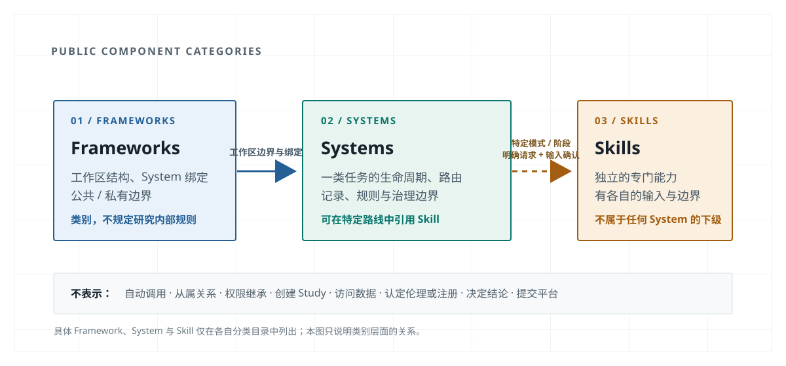

# Chenhaoran Governed Research Collaboration

这是一个公开的导航门户，用于解释已维护科研协作组件之间的关系、进入条件和边界。它不替代任何组件仓库中的正式规则，也不保存研究材料。

## 从哪里开始

- 想讨论或启动一个可能的新研究：从[可能的新研究](user-paths/possible-new-study.md)进入。
- 已有 Study 正在分析、写手稿或处理返修：从[既有 Study、手稿与返修](user-paths/existing-study-manuscript-revision.md)进入。
- 已确认适用路线且明确需要伦理准备：查看[伦理准备何时可进入](user-paths/ethics-preparation.md)。

## 组件关系

1. [Governed Research Workspace Framework](framework.md)提供工作区边界、System 注册和所有权骨架。
2. [Governed Research Workflow](systems/governed-research-workflow.md)是受治理研究工作的主要入口与路线控制层。
3. [research-ethics](skills/research-ethics.md)不是自动入口；仅在明确请求和已确认条件满足时才可进入。

完整边界见[架构地图](architecture-map.md)。当前公开版本见[版本与兼容](releases.md)。
